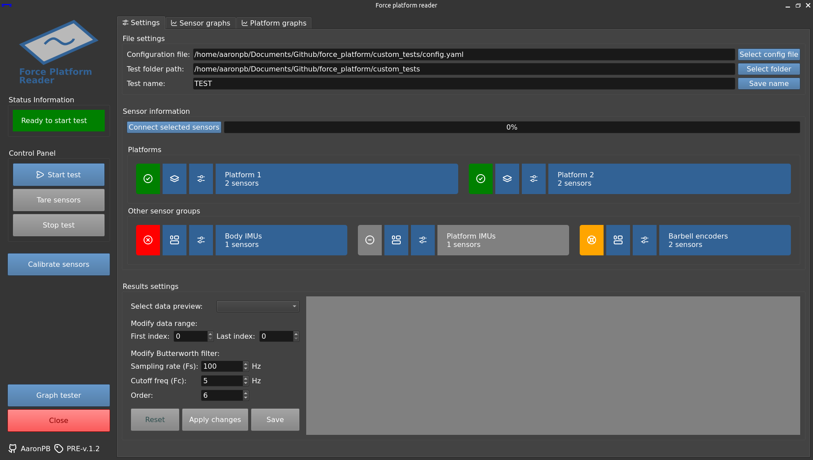

<p align="center">
  <a href="#readme"></a>
</p>
<p align="center">
  <a href="#readme"></a>
  <a href="https://github.com/psf/black"></a>
  <a href="https://github.com/AaronPB/force_platform/actions/workflows/project_test.yaml"></a>
  <a href="docs/home.md"></a>
</p>

## Information

A python software for synchronized data management of specific force platforms sensors compatible with Phidget API and other sensor types such as IMUs.

This project is part of the author's master's thesis in industrial engineering at the University of Almería. force_platform is licensed under de GNU General Public License v3.0.



It supports currently the following sensor types:
- Phidget-Bridge compatible load sensors. (Requires Phidget dependency).
- Phidget encoders. (Requires Phidget dependency).
- Taobotics IMU sensors. (Requires MRPT dependency).
- USB webcams for video recording with opencv.

## Documentation

Program documentation is available to learn how the program works and its usage.

Check it out [here](docs/home.md).

## Quick setup

To use this project, clone it and install the project requirements.

> [!TIP]\
> Do it in a virtual environment to avoid module installation issues (using `virtualenv`, for example).

> This project is developed with Python v3.10.6

Project requirements:
```bash
pip install -r requirements.txt
```

### Phidget dependency

For [Linux](https://www.phidgets.com/docs/OS_-_Linux#Quick_Downloads):

```bash
curl -fsSL https://www.phidgets.com/downloads/setup_linux | sudo -E bash - &&\
sudo apt-get install -y libphidget22
```

> For [Windows](https://www.phidgets.com/docs/OS_-_Windows#Quick_Downloads) or [MacOS](https://www.phidgets.com/docs/OS_-_macOS#Quick_Downloads)

### MRPT dependency

For more information, refer to the [MRPT Documentation](https://docs.mrpt.org/reference/latest/download-mrpt.html#debian-ubuntu-ppa)

```bash
sudo add-apt-repository ppa:joseluisblancoc/mrpt
sudo apt install libmrpt-dev mrpt-apps
sudo apt install python3-pymrpt
```

> [!WARNING]\
> If you are using `virtualenv`, MRPT cannot be installed by pip. As a temporary solution, set `include-system-site-packages = true` in your `pyvenv.cfg` file.
