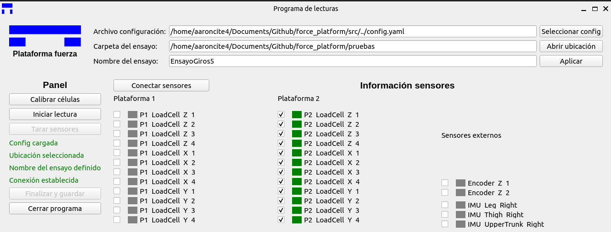
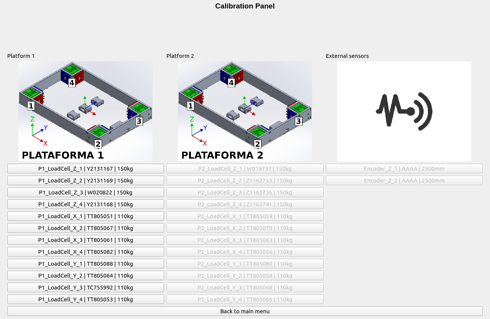
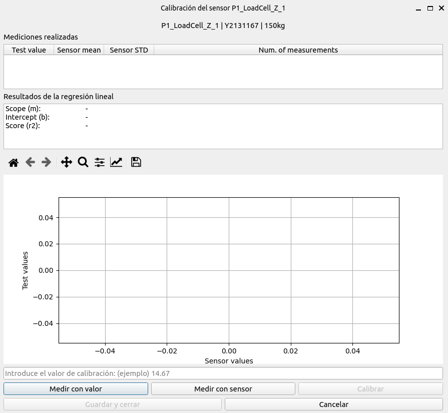
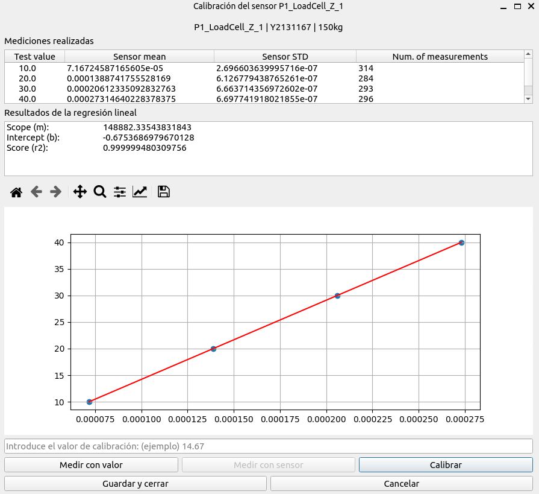

[:house: `Back to Home`](../home.md)

# Calibration process
**Work in progress**

Previously, you need to connect the sensors you want to calibrate in the main GUI as shown in the following picture.

Then, click on the `Calibrar células` button on the left panel. This button will be available if at least one of the selected sensors is connected.

## Calibration menu

This menu will replace the main GUI, with the compatible sensors. The appearance of the calibration menu is presented in the following image.

The menu loads all compatible sensor lists defined in defined in `config.yaml`, but only the connected ones will be enabled.

> If the desired sensor to be calibrated is not enabled, close de calibration menu and try to reconnect the sensors. It needs to get a green check in the sensor information table.

The compatible sensors are:
- Phidget platform loadcells.
- Phidget encoders.

In order to preform a calibration test, click the enabled button of the connected sensor.

## Calibration test of a sensor

A new window will pop up when clicking an enabled sensor button. The displayed GUI is as shown here.

The window is structured in the following sections:
- A table in which all measurements will be recorded and the most relevant data (such as the mean and variance of the data sample) are displayed.
- An empty field and graph where the results of the linear regression will be presented.
- A control panel divided into two rows: the first row to manage the calibration test and the second row to exit the submenu.

Calibration is performed by applying known values of weight (or other physical quantity) to the sensor and measuring its output. The test is performed by applying different values in order to establish a linear relationship and obtain a regression line.

The calibration program allows the known value to be recorded in two ways:
- **Manually**: when the calibration value is known.
- **With a reference sensor**: when the calibration value is unknown or higher accuracy is required. In this case it is necessary to use a calibrated sensor.

The following sections shows how to record values in the two ways.

### Calibrate with manual inputs

To calibrate with known values you must follow these steps:

1. Apply the known magnitude to the sensor.
2. Enter the value in the text field located just below the graph. It can be indicated with or without decimals.
3. Click on the `Medir con valor` button and wait until the buttons are re-enabled.
4. The measurement will appear in the table when it is done.
5. Repeat this procedure as many times as desired.

### Calibrate with calibration sensor input

To calibrate using the reference sensor, you must first declare it in the [`calibration_sensor` section](../setup/config_file.md#calibration-sensor) of the `config.yaml` file.

Once defined, run the program, connect the sensors to be calibrated and access the calibration window again.

The program will try to connect the reference sensor when entering the pop-up window. If no connection is established, an error will appear on console and the `Medir con sensor` button will not be available.

If the button is active, then the sensor is correctly connected. The steps to proceed in this case are as follows:
1. Apply the known magnitude to the sensor.
2. Click on the `Medir con sensor` button and wait until the buttons are re-enabled.
3. The measurement will appear in the table when it is done.
4. Repeat this procedure as many times as desired.

### Generate the calibration results
Once all measurements have been taken, linear regression can be performed by clicking on the `Calibrar` button.

> A minimum of two measurements must be taken for the `Calibrar` button to be available.

This will generate a graph with the regression line obtained (in red) and the measurements taken (as blue dots). The values of the line are displayed above the graph.

It is possible to continue measuring and click the `Calibrar` button again to calculate a new regression line taking into account all the values.

### Save or discard the calibration
When the first regression line is calculated the `Guardar y cerrar` button in the second row will be enabled. Click here to close the window and overwrite the sensor calibration values in the config file with the calibration results.

If at any time you wish to cancel the calibration test, click the `Cancelar` button.

## Calibration settings
It is possible to modify the data reading time and frequency in the [`general settings` section](../setup/config_file.md#general-settings) of the `config.yaml` file.

It is also possible to change the reference sensor in the [`calibration_sensor` section](../setup/config_file.md#calibration-sensor) of the same file.

---

[:house: `Back to Home`](../home.md)