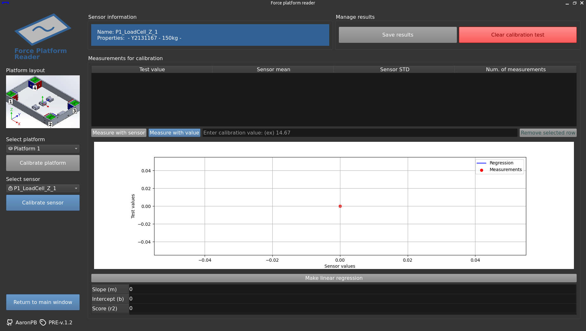
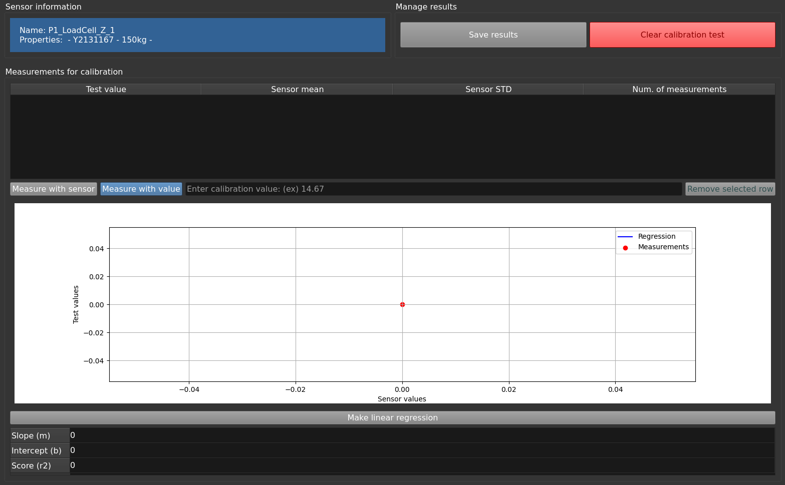
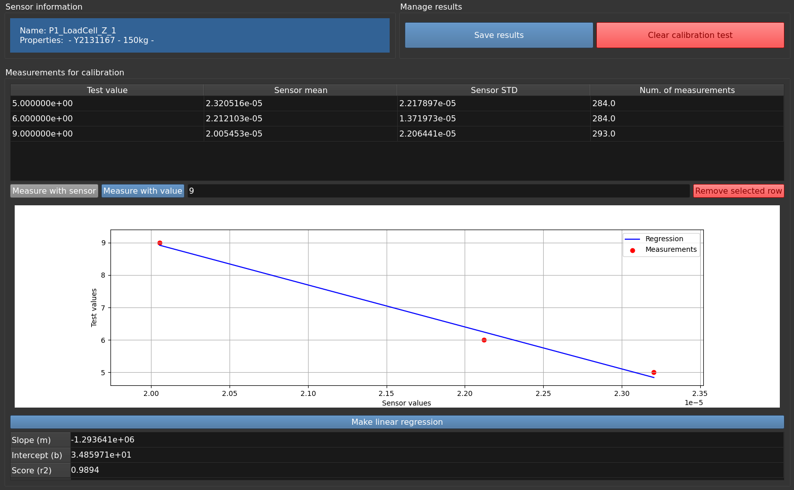

[:house: `Back to Home`](../home.md)

# Calibration process

Calibration process are only available for **platform sensors** defined in the [`sensor_groups` config section](../setup/config_file.md#sensor-groups-section) .

To access the calibration menu, click on the <kbd>Calibrate sensors</kbd> button on the left panel.

## Calibration menu

At the left side, the menu loads all compatible sensor groups defined in `config.yaml`, but only the connected ones will be shown. You can connect the sensors previously from the main menu.

> [!TIP]
> Need more information about how to connect sensors? Check the [sensor connection](general_test.md#sensor-connection) section of the general test procedure.

In order to preform a calibration test, click the enabled button of the connected sensor.

## Calibration test of a sensor

The right part of the calibration menu will update with the sensor information at the top when clicking an enabled sensor button, as shown here.

The window is structured in the following sections:
- Sensor information and general test buttons.
- A table in which all measurements will be recorded and the most relevant data (such as the mean and variance of the data sample) are displayed.
- An horizontal set of buttons to manage the measurements.
- An empty graph and table where the results of the linear regression will be presented.
- A button to make the linear regression.

Calibration is performed by applying known values of weight (or other physical quantity) to the sensor and measuring its output. The test is performed by applying different values in order to establish a linear relationship and obtain a regression line.

The calibration program allows the known value to be recorded in two ways:
- **Manually**: when the calibration value is known.
- **With a reference sensor**: when the calibration value is unknown or higher accuracy is required. In this case it is necessary to use a calibrated sensor.

The following sections shows how to preform each action.

> [!NOTE]
> If a measurement goes wrong, you can remove it selecting the correspondent row from the measurement table and click the <kbd>Remove selected row</kbd> button.

### Calibrate with manual inputs

To calibrate with known values you must follow these steps:

1. Apply the known magnitude to the sensor.
2. Enter the value in the text field located just below the graph. It can be indicated with or without decimals.
3. Click on the <kbd>Measure with value</kbd> button and wait until the buttons are re-enabled.
4. The measurement will appear in the table when it is done.
5. Repeat this procedure as many times as desired.

### Calibrate with calibration sensor input

To calibrate using the reference sensor, you must first declare it in the [`calibration_sensors` section](../setup/config_file.md#calibration-sensors-section) of the `config.yaml` file. 

Once defined, run the program, connect the sensors to be calibrated and access the calibration window again.

The program will try to connect the reference sensor when clicking an available sensor. If no connection is established, a warning will appear on console and the <kbd>Measure with sensor</kbd>button will not be available.

If the button is active, then the sensor is correctly connected. The steps to proceed in this case are as follows:
1. Apply the known magnitude to the sensor.
2. Click on the <kbd>Measure with sensor</kbd> button and wait until the buttons are re-enabled.
3. The measurement will appear in the table when it is done.
4. Repeat this procedure as many times as desired.

### Generate the calibration results
Once all measurements have been taken, linear regression can be performed by clicking on the <kbd>Make linear regression</kbd> button.

> [!IMPORTANT]
> A minimum of two measurements must be taken for the <kbd>Make linear regression</kbd> button to be available.

This will generate a graph with the regression line obtained (in red) and the measurements taken (as blue dots). The values of the line are displayed above the graph.

It is possible to continue measuring and click the <kbd>Make linear regression</kbd> button again to calculate a new regression line taking into account all the values.

### Save or discard the calibration
When the first regression line is calculated the <kbd>Save results</kbd> button in the second row will be enabled. Click here to overwrite the sensor calibration values in the config file with the calibration results.

If at any time you wish to cancel the calibration test, click the <kbd>Clear calibration test</kbd> button or select another available sensor from the left side.

## Calibration settings
It is possible to modify the data reading time and frequency in the [`settings` section](../setup/config_file.md#settings-section) of the `config.yaml` file.

It is also possible to change the reference sensor in the [`calibration_sensors` section](../setup/config_file.md#calibration-sensors-section) of the same file.

---

[:house: `Back to Home`](../home.md)