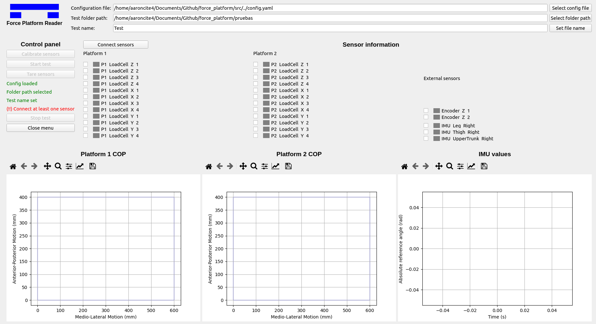
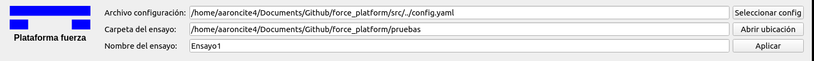
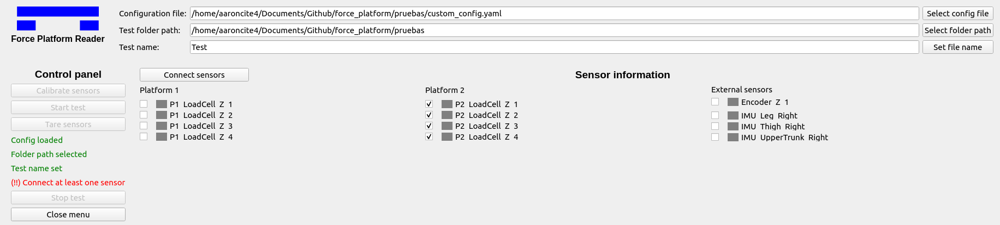
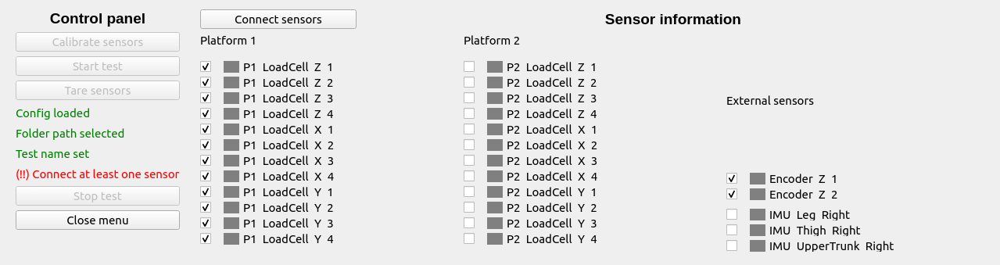
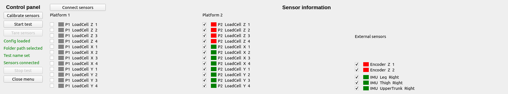
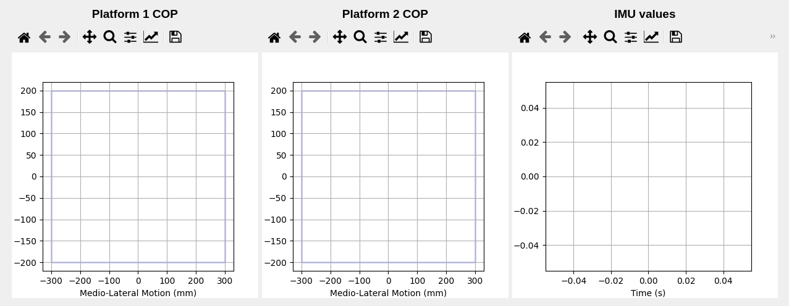

[:house: `Back to Home`](../home.md)

# General test procedure
**Work in progress**

The main objective of the program is to record data from the connected sensors in a synchronised manner and to generate a file in `.csv` format at the end of each trial.

When running the `main.py` file of the program, a window like this will open:

The interface is organised in three main sections which will be detailed below:
- File management.
- Control panel and sensor connection.
- Plot results.

## File management

In this section you can configure the following options listed below.

### Load a custom configuration file

It is possible to load another `.yaml` file than the default `config.yaml` file. This is useful when you want to run tests that have different sensor and platform layouts and other calibration values.

If you want to load another configuration file, click on the <kbd>Select config file</kbd> button and select the custom file with extension `.yaml`.

Once selected, if it is in the correct format, the window will be updated with the new sensor information.

The path to the custom configuration will also be saved in the default configuration file (`config.yaml`) to be loaded automatically each time the program is launched.

> This can be cancelled by deleting the custom configuration path in the default `config.yaml` file.

### Folder and file name of the test

The other two fields in this section are used to indicate in which folder you want to generate the files containing the sensor readings and the name of these files.

They will be saved in `.csv` format, either with the calibration data applied as well as in raw format (without applying any type of conversion to the sensor output data).

## Control panel

This section is the main core of the software and is divided into two parts. On the left is the control panel with various buttons. On the right is an area divided into three columns, with information from the list of sensors provided in the configuration file.

When running the program, initially all the buttons on the control panel are disabled. This is because the sensors have to be connected beforehand.

### Sensor connection

To connect the sensors you must mark the ones you want to connect in the **Sensor information** table by clicking on the checkboxes. In case you do not want to connect a certain sensor that has a checkbox selected, simply deselect it by clicking on the checkbox again.

Once marked, press the <kbd>Connect sensors</kbd> button. Depending on the type and number of sensors it will take some time to establish connection with all of them.

Once a connection is established (or not) with the indicated sensors, the table will be updated with the status of each sensor with one of the following colours listed here:

| Color | Description |
| :---: | :--- |
|| No connection attempted. |
|| Connection could not be established. |
|| Connection successfully established. |

If at least one sensor is connected and the requirements indicated on the control panel are met, the buttons will be enabled to start the tests.

### Control panel functions

The control panel offers several functions as detailed below.

#### Calibration of the connected sensors

It is possible to calibrate the connected sensors by clicking on the `Calibrate cells` button. For more information, see the [Calibrate sensors](calibration_test.md) section.

#### Execute sensor reading

This would be the main process of the test. When the <kbd>Start test</kbd> button is pressed, the processes for each sensor are initiated, the `.csv` file header is set up, and the readings are recorded at the frequency defined in the [`general settings` section](../setup/config_file.md#general-settings) of the `config.yaml` file.

> This process may take a few seconds depending on the number of sensors. When all processes have initialized, the <kbd>Stop test</kbd> button will be available.

During the reading process the <kbd>Tare sensors</kbd> button will also be available to tare the loadcell and encoder type sensors.

## Plot results

*TODO*

---

[:house: `Back to Home`](../home.md)
