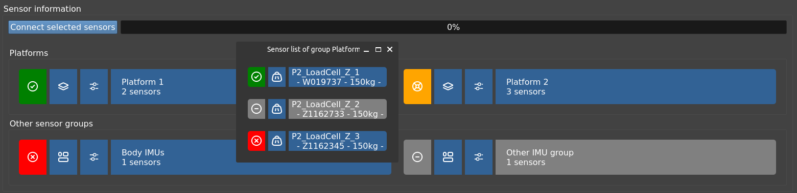

[:house: `Back to Home`](../home.md)

# General test procedure

The main objective of the program is to record data from the connected sensors in a synchronised manner and to generate a file in `.csv` format at the end of each trial.

When running the `main.py` file of the program, a window like this will open:

The interface is organised in three main sections which will be detailed below:
- At the left side:
	- The control panel column.
- At the right:
	- Settings and sensor information tab.
	- Plot tabs.

## Control Panel

| Control panel disabled | Control panel enabled |
| :---: | :---: |
|  | |

When running the program, all the buttons on the control panel are disabled until the following requirements are satisfied:
- There is a valid folder to save the test files. See [Folder and file name of the test](#folder-and-file-name-of-the-test).
- There is at least one sensor available. See [Sensor connection](#folder-and-file-name-of-the-test).

The layer is divided into three parts:
- **Status information box**: informs if all requirements are met.
- Button box:
	- **Start test**: clear all previous data and start a new test with the available sensors.
	- **Tare sensors**: will tare the Phidget LoadCells from the platforms.
	- **Stop test**: finish data recording, plot all results and save the test files to `.csv` format.
- **Calibrate sensors button**: to calibrate the Phidget LoadCells. For more information, see the [Calibrate sensors](calibration_test.md) section.

## Settings and sensor information

This is the default tab where you can configure the following options listed below.

### Load a custom configuration file

It is possible to load another `.yaml` file than the default `config.yaml` file. This is useful when you want to run tests that have different sensor and platform layouts and other calibration values.

If you want to load another configuration file, click on the <kbd>Select config file</kbd> button and select the custom file with extension `.yaml`.

Once selected, if it is in the correct format, the window will be updated with the new sensor information.

The path to the custom configuration will also be saved in the default configuration file (`config.yaml`) to be loaded automatically each time the program is launched.

> [!NOTE]
> This can be cancelled by loading again the default `config.yaml` file or deleting the custom configuration path manually in the [`settings` config section](../setup/config_file.md#settings-section).

### Folder and file name of the test

The other two fields in this section are used to indicate in which folder you want to generate the files containing the sensor readings and the name of these files.

They will be saved in `.csv` format, either with the calibration data applied as well as in raw format (without applying any type of conversion to the sensor output data).

### Sensor connection

This section shows all sensor groups configured in the [`sensor_groups` config section](../setup/config_file.md#sensor-groups-section).

You can select or deselect sensor groups connections by clicking on their names. It is also possible to enable/disable individual sensors from a sensor group via the `settings` button next to it.

> [!NOTE]
> When you click the `settings` button, an additional window will show up with the sensor information. If you want to continue in the main window, close the pop-up window.
> 
> Any modifications will be saved.

You can check the selection status looking at the name background color:

| Background color | Description |
| :---: | :--- |
|  | Selected. |
|  | Not selected. |

Once the sensors are selected, press the <kbd>Connect sensors</kbd> button. Depending on the type and number of sensors it will take some time to establish connection with all of them.

Once a connection is established (or not) with the indicated sensors, the connection background colors will be updated with the status of each sensor as follows:

| Background color | Description for sensor groups | Description for individual sensors |
| :---: | :--- | :--- |
|  | No connection attempted. | No connection attempted. |
|  | All sensors failed to connect. | Connection could not be established. |
|  | Some sensors failed to connect. | - |
|  | All sensors are connected. | Connection successfully established. |

If at least one sensor is connected and the requirements indicated on the control panel are met, the buttons will be enabled to start the tests.

### Results settings

When a test has finished, this section will update with the available data recorded. Here you can modify data limits and the butterworth filter parameters.

You can change the preview graph by clicking other sensor name in the preview selector.

To apply any modifications, click the <kbd>Apply changes</kbd> button. If you want to save the data again with those modifications, click the <kbd>Save</kbd> button. To undo range modifications, click on <kbd>Reset</kbd>.

> [!NOTE]
> The <kbd>Save</kbd> button only apply data range modifications. It does not save filtered data.

All applied modifications will update available sensor graphs. Checkout the following section!

# Graph tabs

There are two tabs available:
- **Sensor graphs** - To see individual sensor data.
- **Platform graphs** - To see specific platform data: total forces and COP data.

All the graph processing is done by the [`DataManager`](../../src/managers/dataManager.py)  class.

## Sensor graphs

Simply click a sensor group at the top selector and an available sensor. The graph will update with the current recorded data from the selected sensor.

You can use the options above to save the generated graph, edit, zoom, etc.

## Platform graphs

As in the previous section, click a sensor group at the top selector and an available option below. The graph will update with the current recorded data.

Use the options above to save the generated graph, edit, zoom, etc.

> [!IMPORTANT]
> This graphs needs special sensor group requirements in order to be available. Check [platform groups configuration](../setup/config_file.md#platform-groups).

---

[:house: `Back to Home`](../home.md)
