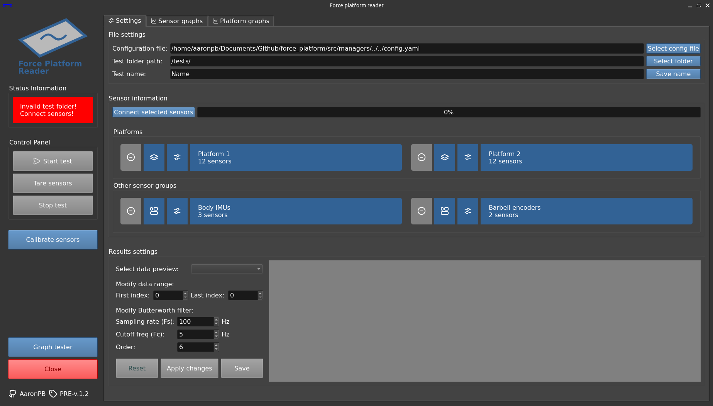
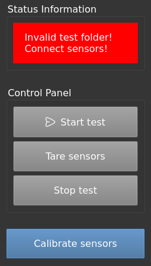
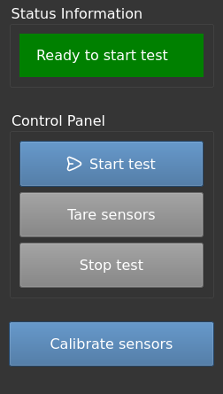
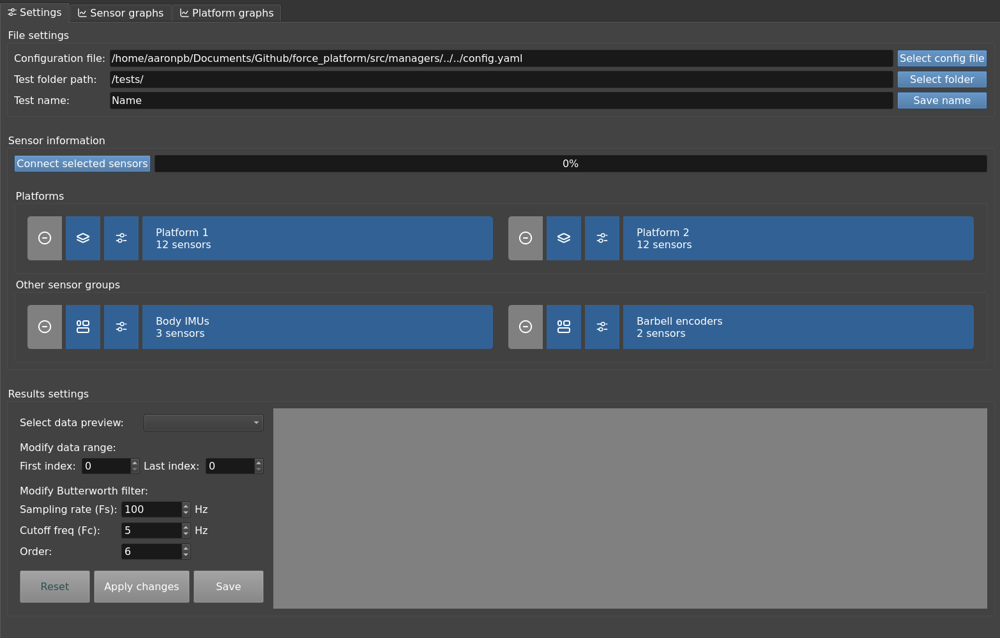
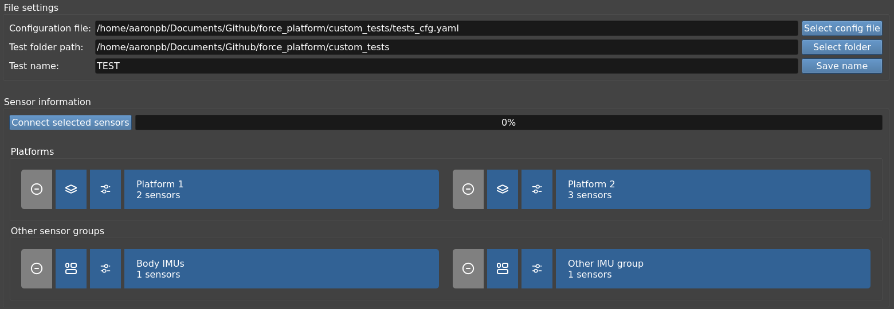
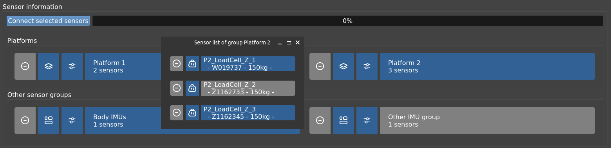

[:house: `Back to Home`](../home.md)

# General test procedure
**Work in progress**

The main objective of the program is to record data from the connected sensors in a synchronised manner and to generate a file in `.csv` format at the end of each trial.

When running the `main.py` file of the program, a window like this will open:

The interface is organised in three main sections which will be detailed below:
- At the left side:
	- The control panel column.
- At the right:
	- Settings and sensor information tab.
	- Plot tabs.

## Control Panel

| Control panel disabled | Control panel enabled |
| :---: | :---: |
|  | |

When running the program, all the buttons on the control panel are disabled until the following requirements are satisfied:
- There is a valid folder to save the test files. See [Folder and file name of the test](#folder-and-file-name-of-the-test).
- There is at least one sensor available. See [Sensor connection](#folder-and-file-name-of-the-test).

The layer is divided into three parts:
- **Status information box**: informs if all requirements are met.
- Button box:
	- **Start test**: clear all previous data and start a new test with the available sensors.
	- **Tare sensors**: will tare the Phidget LoadCells from the platforms.
	- **Stop test**: finish data recording, plot all results and save the test files to `.csv` format.
- **Calibrate sensors button**: to calibrate the Phidget LoadCells. For more information, see the [Calibrate sensors](calibration_test.md) section.

## Settings and sensor information

This is the default tab where you can configure the following options listed below.

### Load a custom configuration file

It is possible to load another `.yaml` file than the default `config.yaml` file. This is useful when you want to run tests that have different sensor and platform layouts and other calibration values.

If you want to load another configuration file, click on the <kbd>Select config file</kbd> button and select the custom file with extension `.yaml`.

Once selected, if it is in the correct format, the window will be updated with the new sensor information.

The path to the custom configuration will also be saved in the default configuration file (`config.yaml`) to be loaded automatically each time the program is launched.

> This can be cancelled by loading again the default `config.yaml` file or deleting the custom configuration path manually.

### Folder and file name of the test

The other two fields in this section are used to indicate in which folder you want to generate the files containing the sensor readings and the name of these files.

They will be saved in `.csv` format, either with the calibration data applied as well as in raw format (without applying any type of conversion to the sensor output data).

### Sensor connection

To connect the sensors you must mark the ones you want to connect in the **Sensor information** table by clicking on the text boxes. In case you do not want to connect a certain sensor that is selected, simply click it again.

You can check the selection status by identifying its color border:

| Border color | Description |
| :---: | :--- |
|| Selected. |
|| Not selected. |

Once the sensors are selected, press the <kbd>Connect sensors</kbd> button. Depending on the type and number of sensors it will take some time to establish connection with all of them.

Once a connection is established (or not) with the indicated sensors, the background colors will be updated with the status of each sensor as follows:

| Background color | Description |
| :---: | :--- |
| No color | No connection attempted. |
|| Connection could not be established. |
|| Connection successfully established. |

If at least one sensor is connected and the requirements indicated on the control panel are met, the buttons will be enabled to start the tests.

## Plot tabs

If enabled in [`general settings` config section](../setup/config_file.md#general-settings), the current recorded data will be displayed in different tabs depending of the available sensors.

All the plot data processing is done by the [`TestDataManager`](../../src/managers/testDataManager.py)  class.

### Platform forces

> Requires `_X_n`, `_Y_n` or `_Z_n` markers in sensor names of [`platform loadcell list` config section](../setup/config_file.md#platform-1-loadcell-list) in order to be plotted.

*TODO plot image*

### Platform COP

> Requires `_X_n`, `_Y_n` or `_Z_n` markers in sensor names of [`platform loadcell list` config section](../setup/config_file.md#platform-1-loadcell-list).

> Requires the 12 platform sensors to be available in order to be plotted.

*TODO plot image*

### Encoders

*TODO plot image*

### IMU angles

*TODO plot image*

---

[:house: `Back to Home`](../home.md)
