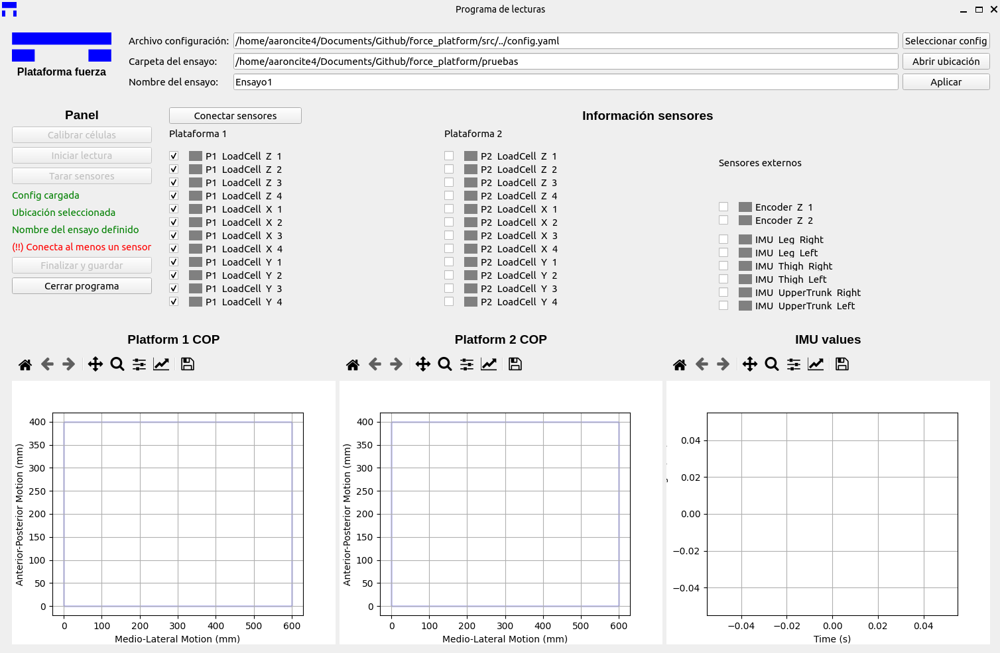

# The Force Platform Documentation

**Please note that this wiki is a work in progress and may be incomplete.**

Welcome to the `force_platform` documentation! Here you will find all the necessary information to be able to manage the program properly.

## Documentation sections

Here is a ordered list of the documentation files provided in this wiki.

1. [Project setup](setup/project.md)
3. [Config file](setup/config_file.md)
4. [Sensors]()
5. [Execute a test]()
6. [Calibrate sensors]()
7. [Example case]()