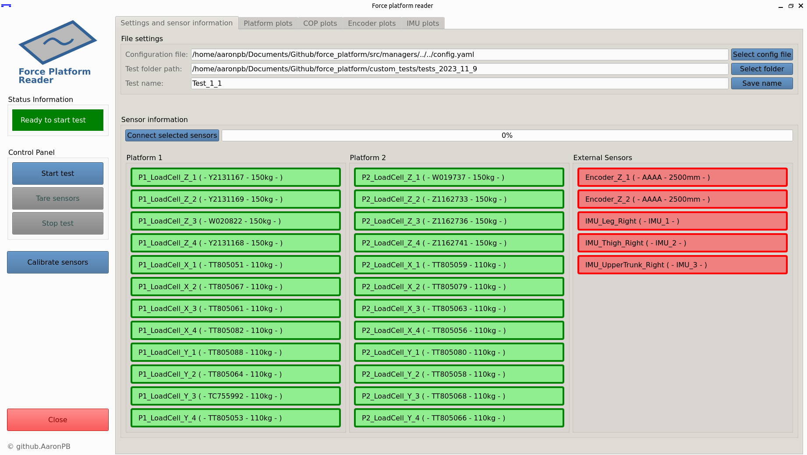

# The Force Platform Documentation

**Please note that this wiki is a work in progress and may be incomplete.**

Welcome to the `force_platform` documentation! Here you will find all the necessary information to be able to manage the program properly.

## Documentation sections

Here is an ordered list of the documentation files provided in this wiki.

1. [Project setup](setup/project.md)
2. [Config file](setup/config_file.md)
3. [Compatible sensors](setup/sensors.md)
4. [Execute a test](features/general_test.md)
5. [Calibrate sensors](features/calibration_test.md)