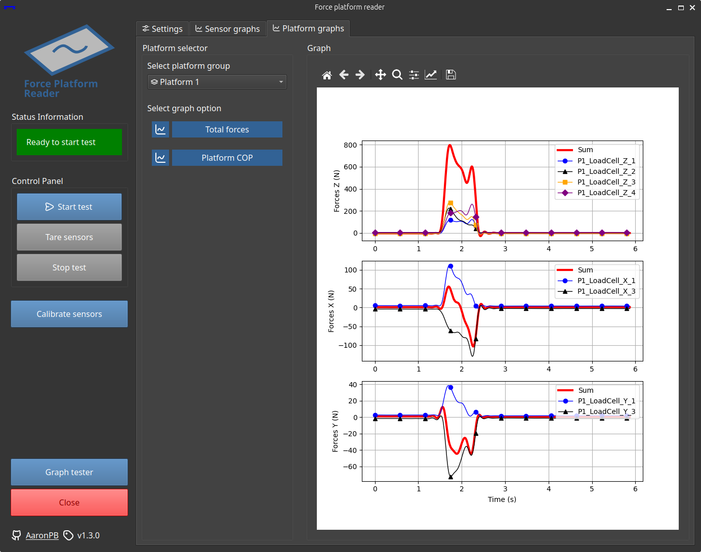

---
hide:
  - navigation
  - toc
title: Home
---
#
<figure markdown="span">

</figure>
<br>
<div class="grid cards" markdown>

-   :fontawesome-solid-truck-fast:{ .lg .middle } __Set up in 10 minutes__

    ---

    Get up and running in minutes

    [:octicons-arrow-right-24: Getting started](setup/project.md)
    
    [:fontawesome-brands-docker: Check a dockerized version](https://hub.docker.com/r/aaronrpb/force-platform-app)

-   :fontawesome-solid-microchip:{ .lg .middle } __Sensor compatibility__

    ---

    The Phidget [Load Cell](https://www.phidgets.com/?tier=2&catid=98&pcid=78) and [Encoder](https://www.phidgets.com/?tier=1&catid=4&pcid=2) interfaces are compatible with a wide range of sensors

    [:octicons-arrow-right-24: More information](setup/sensors.md)

-   :fontawesome-solid-gear:{ .lg .middle } __Highly configurable__

    ---

    Sensors are defined into group types, working in a modular and flexible way

    [:octicons-arrow-right-24: Configuration file](setup/config_file.md)

-   :fontawesome-solid-file-csv:{ .lg .middle } __Data recording and CSV export__

    ---

    It supports sampling rates up to 100 Hz and CSV data export, with or without sensor calibration parameters

-   :fontawesome-solid-sliders:{ .lg .middle } __Calibration feature__

    ---

    It includes an interactive calibration panel to adjust sensor calibration parameters

    [:octicons-arrow-right-24: Calibrate sensors](usage/calibration_test.md)

-   :fontawesome-solid-scale-balanced:{ .lg .middle } __Open Source, GPL-3.0__

    ---

    The software is licensed under the GNU GPL-3.0 and available on [GitHub](https://github.com/AaronPB/force_platform)

    [:octicons-arrow-right-24: License](https://github.com/AaronPB/force_platform/blob/develop/LICENSE)

</div>

## About the Software

<div class="grid" markdown>

<div markdown>

</div>

<div markdown>
A python software for synchronized data management of specific force platforms sensors compatible with [Phidget API](https://www.phidgets.com/docs/Phidget22?srsltid=AfmBOorPWIP_i6m9MabFbrDAVYYXTi3JjgvsbhZHfs7VnlNO6sR47uO3) and other sensor types such as IMUs.

This project is part of the [author](https://github.com/AaronPB)'s master's thesis in industrial engineering at the University of Almería
and funded by the "[Programa Operativo FEDER 2014-2020](https://www.miteco.gob.es/es/ministerio/servicios/ayudas-subvenciones/fondos_feder.html)" and the Andalusian "Consejería de Transformación Económica, Industria, Conocimiento y Universidades", under the project UAL2020-CTS-A2100.

<figure markdown="span">
{ width="500px" }
{ width="500px" }
</figure>

</div>

</div>

<div class="grid cards" markdown>

-   :fontawesome-solid-file-pdf:{ .lg .middle } __SOFTWARE DEVELOPMENT AND CALIBRATION OF A FORCE PLATFORM FOR SPORTS SCIENCE__

    ---

    Check the master's thesis in spanish by clicking the button below. 

    [:fontawesome-solid-globe: &nbsp; Institutional repository *(available soon)*](#){ .md-button .md-button--secondary }

</div>

### A flexible configuration

<div class="grid" markdown>

<div markdown>
The configuration file uses `YAML` format for better readability, and all sensors are stored in a single configuration section for a more structured setup.

Sensors are then organized into __sensor groups__. If a sensor does not belong to a group, it will be ignored.

!!! success "Sensor groups are fully flexible"
    You can define a group with sensors of the same type or different types.

    Within the program, you can enable or disable specific sensors within a group or an entire group.

For more details, check out the following documentation page:

[:fontawesome-solid-gear: &nbsp; Configuration file](setup/config_file.md){ .md-button .md-button--secondary }
</div>

<div markdown>
=== "Settings section"

    *Just simple and straightforward settings.*
    
    *You can even import customized configuration files with different sensors and group setups.*

    ``` yaml
    settings:
      custom_config_path: null
      test:
        name: Name
        folder_path: /tests/
        results:
          save_raw: true
          save_calib: true
      recording:
        data_interval_ms: 10
        tare_data_amount: 300
      calibration:
        data_interval_ms: 10
        data_amount: 300
    ```

=== "Sensor groups section"
    
    *Group your sensors to get specific graphs based on the group type and enhance data organization in CSV exports.*

    ``` yaml
    sensor_groups:
      imus:
        name: Body IMUs
        type: GROUP_DEFAULT
        read: true
        sensor_list:
        - imu_1
        - imu_2
        - imu_3
      barbell_encoders:
        name: Barbell encoders
        type: GROUP_DEFAULT
        read: true
        sensor_list:
        - encoder_1
        - encoder_2
    ```

=== "Sensors section"
    
    *Define all your sensors in this section.*

    ``` yaml
    sensors:
      encoder_1:
        name: Encoder_Z_1
        type: SENSOR_ENCODER
        read: true
        connection:
          channel: 0
          serial: 641800
        initial_position: 0
        properties:
          serial_number: AAAA
          max_length: 2500mm
        calibration:
          slope: 0.01875
          intercept: 0.0
    ```
</div>

</div>

### Data graphs and CSV export

<div class="grid" markdown>

<div markdown>

</div>

<div markdown>

You can visualize the recorded data directly from the graphs tabs.

There are graphs for each recorded sensor, as well as specific ones depending on the sensor group type, such as force platforms.

It is also possible to trim the data and adjust the Butterworth filter used for signal processing.

For data export, the CSV format is used, allowing both raw data export and processed data export using the sensors' calibration parameters.
</div>

</div>

### Quick setup

<div class="grid cards" markdown>

-   :fontawesome-brands-docker:{ .lg .middle } __Simpler? A dockerized and optimized version is available!__

    ---

    Just a quick `docker pull` in your docker environment and you are ready to go!

    === "From DockerHub"

        ``` bash
        docker pull aaronrpb/force-platform-app && \
        docker run -d --name example_app \
            --device /dev/bus/usb:/dev/bus/usb \
            --device /dev/serial:/dev/serial \
            -p 8501:8501 \
            aaronrpb/force-platform-app
        ```

    === "From GHCR"

        ``` bash
        docker pull ghcr.io/aaronpb/force-platform-app && \
        docker run -d --name example_app \
            --device /dev/bus/usb:/dev/bus/usb \
            --device /dev/serial:/dev/serial \
            -p 8501:8501 \
            ghcr.io/aaronpb/force-platform-app
        ```

    [:fontawesome-brands-github: &nbsp; Check out the GitHub repository](https://github.com/AaronPB/force-platform-app){ .md-button .md-button--secondary }

</div>

<div class="grid" markdown>

<div markdown>
Install the required dependencies and clone the project into your workspace.

You can follow this steps to set it up in a few minutes.

!!! warning "Only Linux distributions are supported, preferably Ubuntu 22.04 LTS"
    The project has been developed and tested in Ubuntu 22.04 LTS. Phidget does support [Windows](https://www.phidgets.com/docs/OS_-_Windows#Quick_Downloads)
    and [MacOS](https://www.phidgets.com/docs/OS_-_macOS#Quick_Downloads), but Taobotics IMUs do not.

!!! tip
    Do it in a virtual environment to avoid module installation issues (using `virtualenv`, for example).

    This project is developed with Python v3.10.6
</div>

<div markdown>
<div class="grid cards" markdown>

-   :fontawesome-solid-terminal:{ .lg .middle } __Step 1: Install the external dependencies__

    ---

    === "Phidget22"

        ``` bash
        curl -fsSL https://www.phidgets.com/downloads/setup_linux | sudo -E bash - &&\
        sudo apt-get install -y libphidget22
        ```

    === "MRPT"

        ``` bash
        sudo add-apt-repository ppa:joseluisblancoc/mrpt
        sudo apt install libmrpt-dev mrpt-apps
        sudo apt install python3-pymrpt
        ```

-   :fontawesome-solid-clone:{ .lg .middle } __Step 2: Clone the `force_platform` repository__

    ---

    === "By using the web URL"

        ``` bash
        git clone https://github.com/AaronPB/force_platform.git
        ```

    === "By using SSH"

        ``` bash
        git clone git@github.com:AaronPB/force_platform.git
        ```

-   :fontawesome-solid-file-lines:{ .lg .middle } __Step 3: Install the project requirements__

    ---

    ```bash
    pip install -r requirements.txt
    ```

</div>
</div>

</div>
