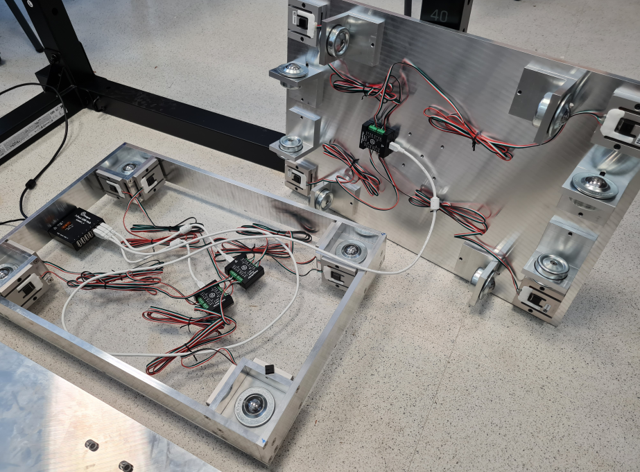

# The project

The work presented in this website has been partially founded by the "[Programa Operativo FEDER 2014-2020](https://www.miteco.gob.es/es/ministerio/servicios/ayudas-subvenciones/fondos_feder.html)" and the Andalusian "Consejería de Transformación Económica, Industria, Conocimiento y Universidades", under the project UAL2020-CTS-A2100 (with the acronym CM-FORCE), entitled "Fabricación y evaluación electromiográfica y biomecánica de un mecanismo de fuerza constante para los ejercicios de acondicionamiento muscular".

<figure markdown="span">
{ width="500px" }
{ width="500px" }
</figure>

The project's title can be translated as "Manufacturing and electromyographic and biomechanical evaluation of a constant force mechanism for muscle conditioning exercises".

## General objectives of CM-FORCE

The founding project aims to:

- Design and implement a constant-force mechanism as a loading system in a Smith-type resistance training machine.
- Evaluate and compare the kinematics, kinetics, electromyographic activity, and muscular forces between free-weight (isoinertial) loading systems and the constant-force mechanism during bench press and squat exercises.

<figure markdown="span">
  { width="100%" }
  <figcaption markdown>CAD design of the constant-force mechanism and an image of the prototype mounted in a H5KS Hounsfield testing machine. [Source](https://www.sciencedirect.com/science/article/pii/S0094114X22000891#fig2).</figcaption>
</figure>

Research articles related to the designed constant-force mechanism:

[:fontawesome-solid-file-invoice: Design and analysis of a constant-force bench press](https://www.sciencedirect.com/science/article/pii/S0094114X19315472){ .md-button .md-button--primary }

[:fontawesome-solid-file-invoice: Experimental validation of a constant-force mechanism and analysis of its performance with a calibrated multibody model](https://www.sciencedirect.com/science/article/pii/S0094114X22000891){ .md-button .md-button--primary }

## Improvement of the sensorization infrastructure in a kinesiology and biomechanics laboratory

In order to enhance the quality of experimental protocols and the reliability of the results obtained throughout the project, an upgrade of the laboratory’s sensor systems was undertaken.

Particular emphasis was placed on the force platforms, which were previously uniaxial, and on achieving precise data synchronization between the force platforms and other measurement devices, including encoders and inertial measurement units (IMUs).

This phase of the CM-FORCE project involved the design of a new triaxial force platform, along with the development of software aimed at synchronizing data across different types and groups of sensors.

## Results

[:fontawesome-solid-flask: Checkout the research section for more details](./research.md){ .md-button .md-button--primary }

### Design of a triaxial force platform

A new triaxial force platform based on uniaxial load cells has been designed and manufactured.

<figure markdown="span">
  { width="100%" }
  <figcaption>Interior of the designed force platform.</figcaption>
</figure>

Fabrication drawings are available and can be downloaded at the following section:

[:material-file-cad:{.lg} Force platform design](./design.md){ .md-button .md-button--primary }

### An affordable open-source 3D force platform and a wide force range calibration method

A new calibration method has been developed for triaxial force platforms using a Smith-type resistance training machine.
Check the article here:

[:fontawesome-solid-file: An affordable open-source 3D force platform and a wide force range calibration method](https://www.sciencedirect.com/science/article/pii/S0263224126006421){ .md-button .md-button--primary }

### Force Platform Reader

The software itself. There are two versions:

- __Legacy version__: the initial software developed with QT version 6.0. This version was made for internal usage and will no longer be maintained.

[:fontawesome-brands-python: Legacy version documentation](../software/legacy_qt/index.md){ .md-button .md-button--primary }

- __Docker version__: a dockerized streamlit app with the main functions of the original software. This is the final product of the software project, with an optimized synchronized recording process using threads in python.

[:fontawesome-brands-docker: Docker version documentation](../software/docker_streamlit/index.md){ .md-button .md-button--primary }
