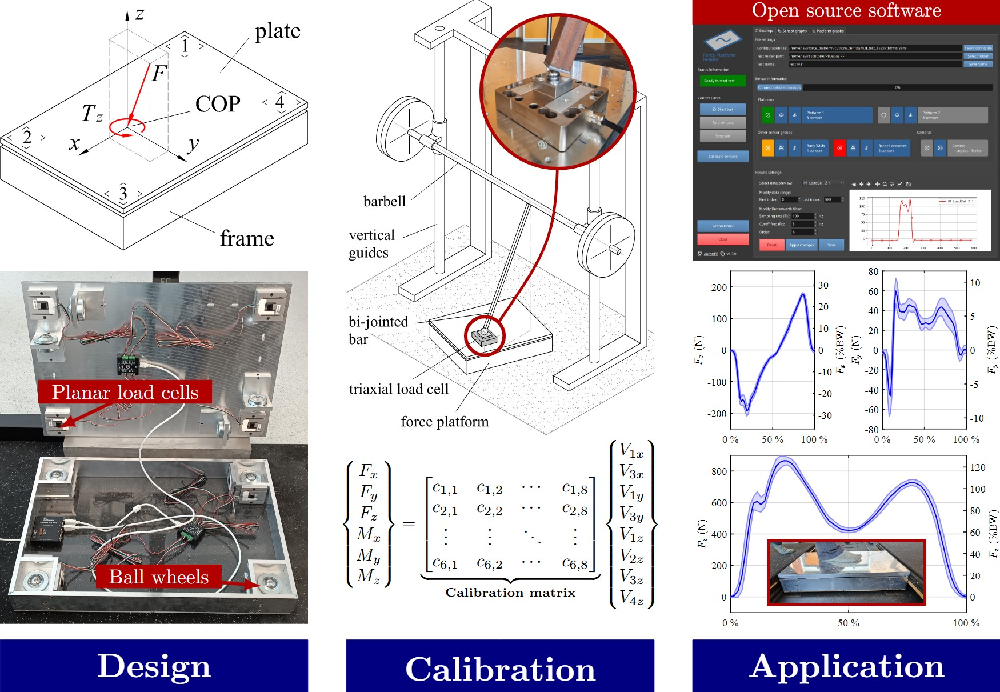
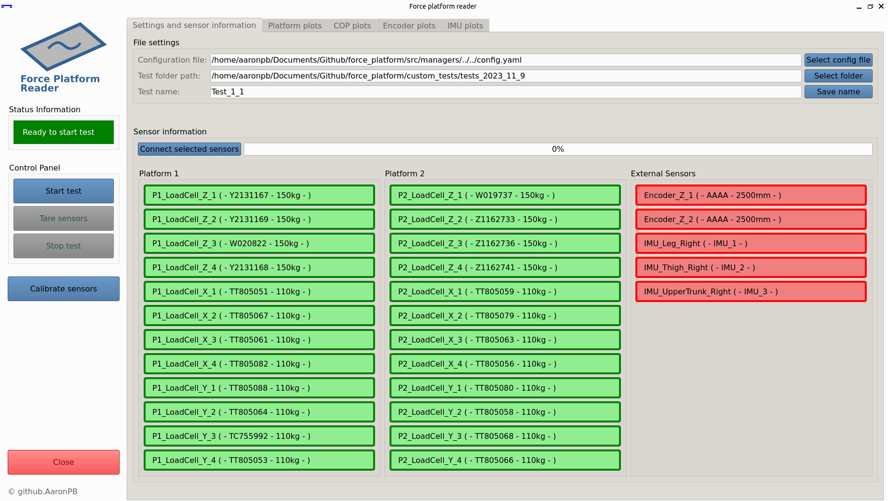

## :fontawesome-solid-file-invoice:{ .lg .middle } An affordable open-source 3D force platform and a wide force range calibration method

[:fontawesome-solid-file: &nbsp; Journal article](https://www.sciencedirect.com/science/article/pii/S0263224126006421){ .md-button .md-button--primary }

This work introduces a novel 3D force platform design grounded on the use of planar uniaxial load cells and ball wheels, easy to
manufacture from off-the-self components leading to an affordable and accurate system. An accompanying open-sourced software
allows an easy use of the force platforms.

A novel calibration method for 3D force platforms is proposed, whose setup uses a
Smith-type bodybuilding machine, a triaxial load cell and a pole, allowing in-situ calibration and the application of multidirectional
loads, including those exceeding body weight. The calibration matrix is obtained by applying least squares and cross-validation
methodology.

<figure markdown="span">
  { width="100%" }
  <figcaption>Article graphical abstract.</figcaption>
</figure>

## :fontawesome-solid-book:{ .lg .middle } Software development and calibration of a force platform for Sports Science

[:fontawesome-solid-graduation-cap: &nbsp; Institutional repository *(available soon)*](#){ .md-button .md-button--secondary }

[Author](https://github.com/AaronPB)'s master's thesis in industrial engineering at the University of Almería

This work aims to develop the data acquisition software and calibration procedure of a
new triaxial force platform, based on uniaxial load cells with force decoupling between
them, ensuring an accurate reading of the normal load to each cell.

The software allows synchronized recording of signals from the force platform, along
with other sensors used in biomechanical analysis such as encoders, inertial sensors,
and cameras. Additionally, it offers a set of tools available to researchers and Sports
Science professionals to visualize and analyze data directly from the software.

<figure markdown="span">
  { width="100%" }
  <figcaption>Developed software: Force Platform Reader.</figcaption>
</figure>

## :fontawesome-solid-file-contract:{ .lg .middle } Utility Model - Triaxial force platform based on uniaxial load cells

[:fontawesome-solid-globe: &nbsp; OEPM Utility Model ES1312312](https://consultas2.oepm.es/InvenesWeb/detalle?referencia=U202431233&trk=public_profile_certification-title){ .md-button .md-button--primary }

Utility Model number ES1312312, requested by the universities of Almería and Seville.

__Inventors__

- Javier López Martínez
- Aarón Raúl Poyatos Bakker
- Silvia Sánchez Salinas
- José Luis Blanco Claraco
- José María Muyor Rodríguez
- Daniel García Vallejo

<figure markdown="span">
  { width="100%" }
  <figcaption>Interior of the designed force platform.</figcaption>
</figure>
