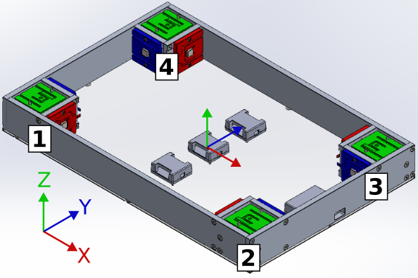

[:house: `Back to Home`](../home.md)

# Config File

Config main content:
- [Settings section](#settings-section)
- [Sensor groups section](#sensor-groups-section)
	- [Platform groups](#platform-groups)
- [Calibration sensors section](#calibration-sensors-section)
- [Sensors section](#sensors-section)
	- [Loadcell sensor](#loadcell-sensor)
	- [Encoder sensor](#encoder-sensor)
	- [IMU sensor](#imu-sensor)

## Settings section

https://github.com/AaronPB/force_platform/blob/55d561fa79855c7706b47aab6820b150fe71fe82/config.yaml#L1-L14

Information of all the keys involved in this config section:

| Key | Type | Description |
| :--- | :---: | :--- |
| `custom_config_path` | STRING | Custom config to load instead of this default config. Set to `null` if the default config is needed. |
| `test.name` | STRING | Name of the generated `csv` files. |
| `test.folder` | STRING | Path to desired folder where the `csv` files will be saved. |
| `test.results.save_raw` | BOOL | Save file without calibrated values. A `_RAW` suffix will be added to the file name. |
| `test.results.save_calib` | BOOL | Save file with calibrated values defined in `config`. |
| `recording.data_interval_ms` | INT | Data recording frequency (in ms). |
| `recording.tare_data_amount` | INT | Amount of values to be recorded during tare process. |
| `calibration.data_interval_ms` | INT | Data recording frequency (in ms). |
| `calibration.data_amount` | INT | Amount of values to be recorded during calibration. |

## Sensor groups section
Define sensor combinations, even from different types!

https://github.com/AaronPB/force_platform/blob/55d561fa79855c7706b47aab6820b150fe71fe82/config.yaml#L15-L32

> [!IMPORTANT]
> All listed sensors needs to be configured in the [`sensors` config section](#sensors-section).
> 
> Using the same sensors in multiple sensor groups is not recommended.

Information of all the keys involved in this config section:

| Key | Type | Description |
| :--- | :---: | :--- |
| `platform1` | STRING | ID of group section. |
| `name` | STRING | Group name. |
| `type` | STRING | Group type: `GROUP_DEFAULT` or `GROUP_PLATFORM`. |
| `read` | BOOL | Enable or disable entire group data recording. Can be modified in GUI. |
| `sensor_list` | LIST | A string list of sensor IDs, configured in [`sensors` config section](#sensors-section). |

### Platform groups
Configure a platform with the `GROUP_PLATFORM` type. This group type only expects  `SENSOR_LOADCELL` type sensors, with a maximum of 12 (4 sensors on each axis).

To obtain platform graphs such as **total forces** or **COP values**; sensors must have the following strings included in their names:
- The 4 X-axis sensors: `_X_n`.
- The 4 Y-axis sensors: `_Y_n`.
- The 4 Z-axis sensors: `_Z_n`.

Being $n = \{1, 2, 3, 4\}$ depending on the sensor location in the platform:

## Calibration sensors section
Declare here a valid reference sensor for each calibration process.

https://github.com/AaronPB/force_platform/blob/55d561fa79855c7706b47aab6820b150fe71fe82/config.yaml#L65-L67

> [!IMPORTANT]
> All sensors needs to be configured in the [`sensors` config section](#sensors-section) and **match the required sensor type**.

Information of all the keys involved in this config section:

| Key | Type | Description |
| :--- | :---: | :--- |
| `phidget_loadcell_reference` | STRING | Sensor ID of type `SENSOR_LOADCELL`. |
| `platform_reference` | STRING | **WIP** Sensor ID of type `SENSOR_TRIAXIAL_LOADCELL`. |

## Sensors section
This section contains all the sensors that will be used in the previous sections.

https://github.com/AaronPB/force_platform/blob/55d561fa79855c7706b47aab6820b150fe71fe82/config.yaml#L68-L69

Depending on the sensor type, a specific set of parameters is required. Below are the available parameters for each sensor type.

### Loadcell sensor

https://github.com/AaronPB/force_platform/blob/55d561fa79855c7706b47aab6820b150fe71fe82/config.yaml#L69-L81

Required keys information:

| Key | Type | Description |
| :--- | :---: | :--- |
| `p1_z1` | STRING | Sensor ID. |
| `name` | STRING | Sensor name. |
| `type` | STRING | Sensor type: `SENSOR_LOADCELL`. |
| `read` | BOOL | Enable or disable sensor data recording. Can be modified in GUI. |
| `connection.channel` | INT | Channel number (0 to 3) in Phidget device. |
| `connection.serial` | INT | USB serial number of Phidget device. |
| `properties` | - | (Could be empty) Configuration section where you can provide more information. |
| `calibration.slope` | INT | Slope parameter. |
| `calibration.intercept` | INT | Intercept parameter. |

### Encoder sensor

https://github.com/AaronPB/force_platform/blob/55d561fa79855c7706b47aab6820b150fe71fe82/config.yaml#L382-L395

Required keys information:

| Key | Type | Description |
| :--- | :---: | :--- |
| `encoder_1` | STRING | Sensor ID. |
| `name` | STRING | Sensor name. |
| `type` | STRING | Sensor type: `SENSOR_ENCODER`. |
| `read` | BOOL | Enable or disable sensor data recording. Can be modified in GUI. |
| `connection.channel` | INT | Channel number (0 to 3) in Phidget device. |
| `connection.serial` | INT | USB serial number of Phidget device. |
| `initial_position` | INT | The initial value of the encoder state. The sensor generates incremental values. |
| `properties` | - | (Could be empty) Configuration section where you can provide more information. |
| `calibration.slope` | INT | Slope parameter. |
| `calibration.intercept` | INT | Intercept parameter. |

### IMU sensor

https://github.com/AaronPB/force_platform/blob/55d561fa79855c7706b47aab6820b150fe71fe82/config.yaml#L410-L417

Required keys information:

| Key | Type | Description |
| :--- | :---: | :--- |
| `imu_1` | STRING | Sensor ID. |
| `name` | STRING | Sensor name. |
| `type` | STRING | Sensor type: `SENSOR_IMU`. |
| `read` | BOOL | Enable or disable sensor data recording. Can be modified in GUI. |
| `connection.serial` | STRING | Absolute USB path. Use `ll /dev/serial/by-path/`. |
| `properties` | - | (Could be empty) Configuration section where you can provide more information. |

---

[:house: `Back to Home`](../home.md)