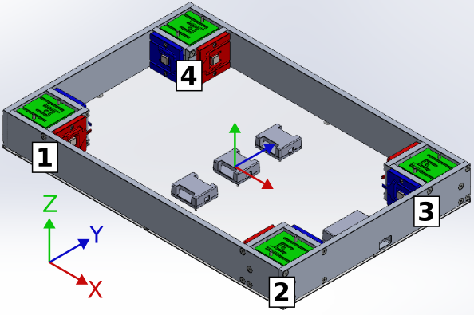

# Config File

## Settings section

```yaml
settings: 
  custom_config_path: null 
  test: 
    name: Name 
    folder_path: /tests/ 
    results: 
      save_raw: true 
      save_calib: true 
  recording: 
    data_interval_ms: 10 
    tare_data_amount: 300 
  calibration: 
    data_interval_ms: 10 
    data_amount: 300 
```

Information of all the keys involved in this config section:

| Key | Type | Description |
| :--- | :---: | :--- |
| `custom_config_path` | STRING | Custom config to load instead of this default config. Set to `null` if the default config is needed. |
| `test.name` | STRING | Name of the generated `csv` files. |
| `test.folder` | STRING | Path to desired folder where the `csv` files will be saved. |
| `test.results.save_raw` | BOOL | Save file without calibrated values. A `_RAW` suffix will be added to the file name. |
| `test.results.save_calib` | BOOL | Save file with calibrated values defined in `config`. |
| `recording.data_interval_ms` | INT | Data recording frequency (in ms). |
| `recording.tare_data_amount` | INT | Amount of values to be recorded during tare process. |
| `calibration.data_interval_ms` | INT | Data recording frequency (in ms). |
| `calibration.data_amount` | INT | Amount of values to be recorded during calibration. |


## Sensor groups section
Define sensor combinations, even from different types!

```yaml
sensor_groups: 
  platform_1: 
    name: Platform 1 
    type: GROUP_PLATFORM 
    read: true 
    sensor_list: 
    - p1_z1 
    - p1_z2 
    - p1_z3 
    - p1_z4 
    - p1_x1 
    - p1_x2 
    - p1_x3 
    - p1_x4 
    - p1_y1 
    - p1_y2 
    - p1_y3 
    - p1_y4
```

!!! warning
    All listed sensors needs to be configured in the [`sensors` config section](#sensors-section).

    Using the same sensors in multiple sensor groups is not recommended.

Information of all the keys involved in this config section:

| Key | Type | Description |
| :--- | :---: | :--- |
| `platform1` | STRING | ID of group section. |
| `name` | STRING | Group name. |
| `type` | STRING | Group type: `GROUP_DEFAULT` or `GROUP_PLATFORM`. |
| `read` | BOOL | Enable or disable entire group data recording. Can be modified in GUI. |
| `sensor_list` | LIST | A string list of sensor IDs, configured in [`sensors` config section](#sensors-section). |

### Platform groups
Configure a platform with the `GROUP_PLATFORM` type. This group type only expects  `SENSOR_LOADCELL` type sensors, with a maximum of 12 (4 sensors on each axis).

To obtain platform graphs such as **total forces** or **COP values**; sensors must have the following strings included in their names:

- The 4 X-axis sensors: `_X_n`.
- The 4 Y-axis sensors: `_Y_n`.
- The 4 Z-axis sensors: `_Z_n`.

Being $n = \{1, 2, 3, 4\}$ depending on the sensor location in the platform:




## Calibration sensors section
Declare here a valid reference sensor for each calibration process.

```yaml
sensors_calibration: 
  phidget_loadcell_reference: s_type 
  platform_reference: triaxial 
```

!!! warning
    All sensors needs to be configured in the [`sensors` config section](#sensors-section) and **match the required sensor type**.

Information of all the keys involved in this config section:

| Key | Type | Description |
| :--- | :---: | :--- |
| `phidget_loadcell_reference` | STRING | Sensor ID of type `SENSOR_LOADCELL`. |
| `platform_reference` | STRING | **WIP** Sensor ID of type `SENSOR_TRIAXIAL_LOADCELL`. |


## Sensors section
This section contains all the sensors that will be used in the previous sections.

```yaml
sensors: 
  p1_z1: 
```

Depending on the sensor type, a specific set of parameters is required. Below are the available parameters for each sensor type.

### Loadcell sensor

```yaml
p1_z1: 
  name: P1_LoadCell_Z_1 
  type: SENSOR_LOADCELL 
  read: true 
  connection: 
    channel: 0 
    serial: 583477 
  properties: 
    serial_number: Y2131167 
    max_weight: 150kg 
  calibration: 
    slope: 148893.5596545 
    intercept: -0.6307595051800341
```

Required keys information:

| Key | Type | Description |
| :--- | :---: | :--- |
| `p1_z1` | STRING | Sensor ID. |
| `name` | STRING | Sensor name. |
| `type` | STRING | Sensor type: `SENSOR_LOADCELL`. |
| `read` | BOOL | Enable or disable sensor data recording. Can be modified in GUI. |
| `connection.channel` | INT | Channel number (0 to 3) in Phidget device. |
| `connection.serial` | INT | USB serial number of Phidget device. |
| `properties` | - | (Could be empty) Configuration section where you can provide more information. |
| `calibration.slope` | INT | Slope parameter. |
| `calibration.intercept` | INT | Intercept parameter. |

### Encoder sensor

```yaml
encoder_1: 
  name: Encoder_Z_1 
  type: SENSOR_ENCODER 
  read: true 
  connection: 
    channel: 0 
    serial: 641800 
  initial_position: 0 
  properties: 
    serial_number: AAAA 
    max_length: 2500mm 
  calibration: 
    slope: 0.01875 
    intercept: 0.0 
```

Required keys information:

| Key | Type | Description |
| :--- | :---: | :--- |
| `encoder_1` | STRING | Sensor ID. |
| `name` | STRING | Sensor name. |
| `type` | STRING | Sensor type: `SENSOR_ENCODER`. |
| `read` | BOOL | Enable or disable sensor data recording. Can be modified in GUI. |
| `connection.channel` | INT | Channel number (0 to 3) in Phidget device. |
| `connection.serial` | INT | USB serial number of Phidget device. |
| `initial_position` | INT | The initial value of the encoder state. The sensor generates incremental values. |
| `properties` | - | (Could be empty) Configuration section where you can provide more information. |
| `calibration.slope` | INT | Slope parameter. |
| `calibration.intercept` | INT | Intercept parameter. |

### IMU sensor

```yaml
imu_1: 
  name: IMU_Leg_Right 
  type: SENSOR_IMU 
  read: true 
  connection: 
    serial: /dev/serial/by-path/pci-0000:00:14.0-usb-0:1.1.4.3:1.0-port0 
  properties: 
    tag: IMU_1
```

Required keys information:

| Key | Type | Description |
| :--- | :---: | :--- |
| `imu_1` | STRING | Sensor ID. |
| `name` | STRING | Sensor name. |
| `type` | STRING | Sensor type: `SENSOR_IMU`. |
| `read` | BOOL | Enable or disable sensor data recording. Can be modified in GUI. |
| `connection.serial` | STRING | Absolute USB path. Use `ll /dev/serial/by-path/`. |
| `properties` | - | (Could be empty) Configuration section where you can provide more information. |
