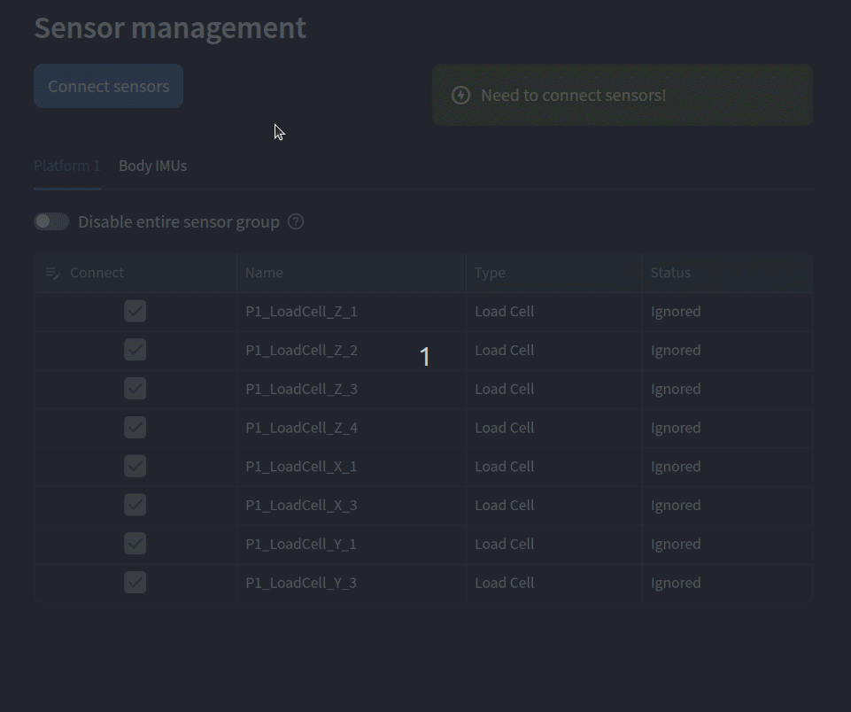

# Simple - Powerful - Dockerized

A dockerized and optimized version of the original software.
It uses asynchronous threads to capture data from each sensor and barriers for synchronized data storage.

Data can be easily checked into datatables in raw, filtered and calibrated versions and be visualized in the graph section.

Built with Streamlit, the interface runs natively in any web browser.
Documentation is fully integrated into the app, making it easy to access and interact with.

## Sensor support

- Phidget-Bridge compatible load sensors.
- Phidget encoders.
- Taobotics IMU sensors.

## Features

- Integrated documentation.
- General settings.
- Data recording and auto recording option within a provided time frame.
- Tare function.
- Data tables preview.
- Filter settings.
- Graphical data visualization and save options into different formats.