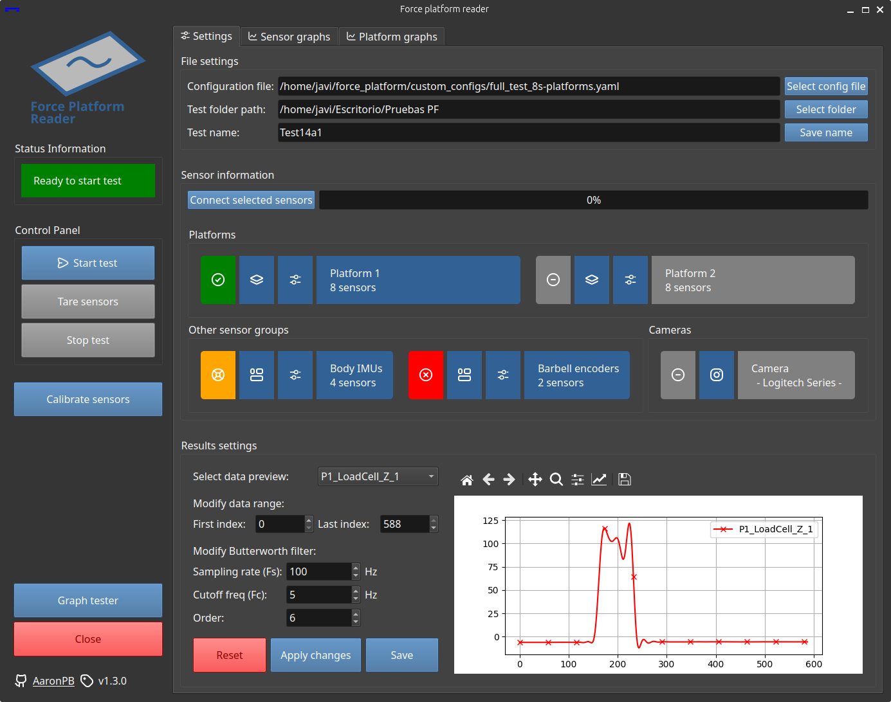

# The original software

The original developed software using Python and QT framework version 6.0 with PySide6.

This software was originally developed for internal use, but it's now publicly available in case others find it useful.

!!! note "Please note that some features may be unstable, and setup may require additional effort"

Sensor data is recorded in a synchronous loop of `QT.Events`.
When the test finishes, the data is filtered and calibration parameters are applied to get the final values.

The software includes also a single sensor calibration feature, using least squares method. The new calibration parameters are saved automatically into de configuration file.

## Sensor support

- Phidget-Bridge compatible load sensors.
- Phidget encoders.
- Taobotics IMU sensors.
- USB webcams for video recording with opencv (BETA).

## Features

- General settings.
- Data recording.
- Tare function.
- Single sensor and full force platform calibration sections.
- Filter and data interval settings.
- Graphical data visualization and save options into different formats.